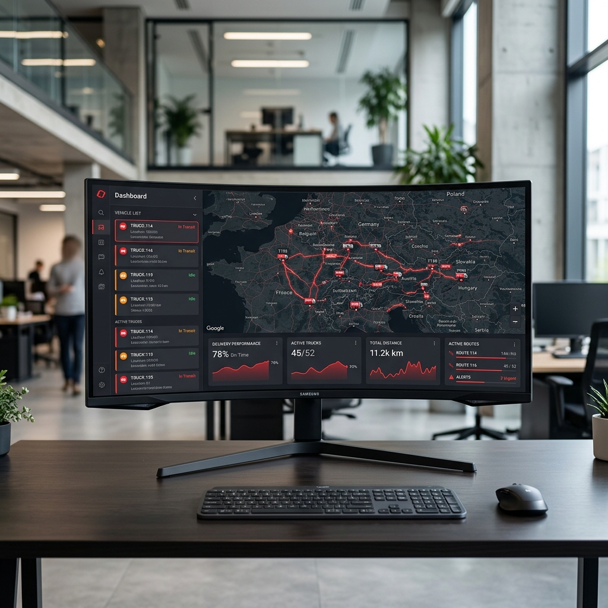

# VNS Website Source Code

This document contains the source code for the active files in the VNS Logistics website project.

## `index.html`

```html
<!DOCTYPE html>
<html lang="en">
<head>
  <meta charset="UTF-8" />
  <meta name="viewport" content="width=device-width, initial-scale=1.0" />
  <title>VNS Logistics | Moving Business Forward</title>
  <meta name="description" content="VNS Logistics provides reliable hauling, container movement, warehouse-to-warehouse transfers, forwarding support, GPS tracking, dashcam visibility, and system-based reports across the Philippines." />
  <link rel="preconnect" href="https://fonts.googleapis.com">
  <link rel="preconnect" href="https://fonts.gstatic.com" crossorigin>
  <link href="https://fonts.googleapis.com/css2?family=Inter:wght@400;500;600;700;800;900&display=swap" rel="stylesheet">
  <link rel="stylesheet" href="styles.css" />
</head>
<body class="parallax-page">
  <header class="site-header" id="top">
    <nav class="nav-shell">
      <a href="#top" class="brand" aria-label="VNS Logistics home">
        <span class="brand-mark">VNS</span>
        <span class="brand-text">Logistics</span>
      </a>
      <button class="menu-toggle" aria-expanded="false" aria-controls="main-nav">Menu</button>
      <div class="nav-links" id="main-nav">
        <a href="#top">Home</a>
        <a href="portal.html">Portal</a>
        <a href="repair.html">Repair & Maintenance</a>
        <a href="parts-inventory.html">Parts Inventory</a>
        <a href="#contact" class="nav-cta">Request Quote</a>
      </div>
    </nav>
  </header>

  <main>
    <section class="hero section-pad">
      <div class="hero-grid container">
        <div class="hero-copy reveal">
          <p class="eyebrow">Philippine Hauling • Container Movement • Forwarding Support</p>
          <h1>Moving Business Forward</h1>
          <p class="hero-subtitle">VNS Logistics helps businesses move cargo with reliable trucking, warehouse-to-warehouse transfers, container hauling, GPS visibility, dashcam support, and system-based reporting.</p>
          <div class="hero-actions">
            <a href="#contact" class="btn btn-primary">Request a Quote</a>
            <a href="#services" class="btn btn-outline">View Services</a>
          </div>
          <div class="hero-proof">
            <div><strong>Since 1995</strong><span>Hauling experience</span></div>
            <div><strong>Nationwide</strong><span>Coverage capability</span></div>
            <div><strong>GPS + Dashcam</strong><span>Fleet visibility</span></div>
          </div>
        </div>

        <div class="hero-visual reveal delay-1" aria-label="Logistics dashboard preview">
          <div class="route-map">
            <div class="pin pin-a"></div>
            <div class="pin pin-b"></div>
            <div class="pin pin-c"></div>
          </div>
          <div class="truck-card glass-card">
            <div class="truck-line"></div>
            <div class="truck-body">
              <span class="cab"></span><span class="trailer"></span>
            </div>
            <p>Warehouse → Port → Plant</p>
          </div>
          <div class="dashboard-card glass-card">
            <div class="dash-header"><span></span><span></span><span></span></div>
            <h3>Fleet Visibility</h3>
            <ul>
              <li><span class="dot green"></span>Live GPS Location</li>
              <li><span class="dot red"></span>Dashcam Equipped</li>
              <li><span class="dot orange"></span>Dispatch Reports</li>
            </ul>
          </div>
          <div class="status-card glass-card">
            <p>Unit Status</p>
            <strong>In Transit</strong>
            <small>Updated 10:42 AM</small>
          </div>
        </div>
      </div>
    </section>

    <!-- Scroll-bound video section -->
    <section class="video-scroll-section" id="video-scroll">
      <div class="video-scroll-sticky">
        <canvas class="video-scroll-bg" id="scroll-canvas"></canvas>
        <div class="video-scroll-overlay"></div>
        <div class="video-scroll-content">
          <div class="video-text video-text-1">
            <p class="eyebrow light">On the Road</p>
            <h2>Reliable Hauling,<br>Every Single Day.</h2>
          </div>
          <div class="video-text video-text-2">
            <p class="eyebrow light">Nationwide Reach</p>
            <h2>From Warehouse<br>to Destination.</h2>
          </div>
          <div class="video-text video-text-3">
            <p class="eyebrow light">VNS Fleet</p>
            <h2>100+ Trucks.<br>Decades of Trust.</h2>
          </div>
        </div>
      </div>
    </section>


    <section class="intro-strip">
      <div class="container strip-grid">
        <p>Trusted logistics support for beverage, packaging, industrial, and commercial cargo movement.</p>
        <a href="#technology">See how VNS monitors cargo movement →</a>
      </div>
    </section>

    <section class="section-pad" id="services">
      <div class="container">
        <div class="section-heading reveal">
          <p class="eyebrow">What We Do</p>
          <h2>End-to-end movement support, from dispatch to delivery.</h2>
          <p>We keep the positioning broad: VNS is not only a trucking provider. VNS supports cargo movement, container transfer, forwarding coordination, and client reporting.</p>
        </div>
        <div class="card-grid services-grid">
          <article class="service-card reveal">
            <span class="icon">01</span>
            <h3>Warehouse-to-Warehouse Transfers</h3>
            <p>Reliable cargo movement between warehouses, plants, depots, ports, and distribution centers.</p>
          </article>
          <article class="service-card reveal delay-1">
            <span class="icon">02</span>
            <h3>Container Hauling</h3>
            <p>Tractor head and chassis support for containerized cargo movement from port, depot, warehouse, or plant.</p>
          </article>
          <article class="service-card reveal delay-2">
            <span class="icon">03</span>
            <h3>Forwarding Support</h3>
            <p>Route planning, trucking assignment, shipment monitoring, and inter-island movement coordination with partners.</p>
          </article>
          <article class="service-card reveal">
            <span class="icon">04</span>
            <h3>Industrial & Commercial Hauling</h3>
            <p>Dependable hauling for beverage, packaging, sugar, resin, bottles, and other cargo requirements.</p>
          </article>
          <article class="service-card reveal delay-1">
            <span class="icon">05</span>
            <h3>GPS-Enabled Dispatch</h3>
            <p>Location links, GPS timestamps, truck status, route progress, and dispatch visibility for operations teams.</p>
          </article>
          <article class="service-card reveal delay-2">
            <span class="icon">06</span>
            <h3>Client Reporting</h3>
            <p>Structured delivery updates, trip summaries, deployment reports, and system-generated movement details.</p>
          </article>
        </div>
      </div>
    </section>

    <section class="section-pad red-section" id="fleet" style="position:relative;overflow:hidden">
      <div class="fleet-bg-image" aria-hidden="true"></div>
      <div class="container fleet-grid" style="position:relative;z-index:2">
        <div class="fleet-copy reveal">
          <p class="eyebrow light">Fleet Capability</p>
          <h2>Built for heavy movement, container transfer, and growing client demand.</h2>
          <p>VNS operates wing vans, tractor heads, flatbed chassis, and long trailer configurations to support different cargo and route requirements.</p>
          <div class="fleet-stats">
            <div><strong>90</strong><span>Employees including executives</span></div>
            <div><strong>100+</strong><span>Owned trucks and hauling units</span></div>
            <div><strong>PH</strong><span>Flexible service coverage</span></div>
          </div>
        </div>
        <div class="fleet-list reveal delay-1">
          <div>10-Wheeler Wing Vans</div>
          <div>12-Wheeler Wing Vans</div>
          <div>6-Wheeler Tractor Heads</div>
          <div>10-Wheeler Tractor Heads</div>
          <div>40-Footer Flatbed Chassis</div>
          <div>42–45 Footer Wing Van Trailers</div>
          <div>55–59 Footer Flatbed / A-Frame Chassis</div>
        </div>
      </div>
    </section>

    <!-- Control room image divider -->
    <div class="parallax-image-divider dark" role="img" aria-label="Fleet monitoring control room">
      
    </div>

    <section class="section-pad" id="technology">
      <div class="container tech-grid">
        <div class="tech-visual reveal">
          <div class="monitor-card">
            <div class="monitor-top">
              <span>VNS Fleet Monitor</span>
              <em>Live</em>
            </div>
            <div class="monitor-map"></div>
            <div class="monitor-row"><span>CDA8651</span><strong>In Transit</strong></div>
            <div class="monitor-row"><span>CAS7575</span><strong>Loading</strong></div>
            <div class="monitor-row"><span>CAG4353</span><strong>Delivered</strong></div>
          </div>
        </div>
        <div class="tech-copy reveal delay-1">
          <p class="eyebrow">Visibility System</p>
          <h2>Details based on the system VNS built.</h2>
          <p>VNS can provide operations details from its internal monitoring workflow: truck location, GPS timestamp, map link, delivery status, dispatch remarks, source, destination, and report summaries.</p>
          <div class="feature-list">
            <div><h4>GPS Tracking</h4><p>Monitor the latest location and movement status of assigned trucks.</p></div>
            <div><h4>Dashcam Support</h4><p>Improve road visibility and incident reference for operations.</p></div>
            <div><h4>System Reports</h4><p>Generate structured updates for clients, dispatchers, and management.</p></div>
          </div>
        </div>
      </div>
    </section>

    <section class="section-pad clients-section" id="clients">
      <div class="container">
        <div class="section-heading reveal">
          <p class="eyebrow">Trusted Experience</p>
          <h2>Serving major Philippine businesses for decades.</h2>
          <p>VNS has a long service history supporting beverage, packaging, and industrial clients.</p>
        </div>
        <div class="client-logos reveal delay-1">
          <span>Coca-Cola Beverages Philippines Inc.</span>
          <span>San Miguel Yamamura Packaging Corp.</span>
          <span>2GO SCAVASI</span>
          <span>Ginebra San Miguel Inc.</span>
          <span>CEMEX</span>
        </div>
      </div>
    </section>

    <section class="section-pad about-section">
      <div class="container about-grid">
        <div class="about-copy reveal">
          <p class="eyebrow">About VNS</p>
          <h2>Reliable hauling roots. Modern logistics direction.</h2>
        </div>
        <p class="about-text reveal delay-1">VNS Logistics Services Phils. Corp. traces its hauling experience back to 1995. Today, the company continues to move forward by combining reliable cargo operations with GPS-enabled fleet monitoring, dashcam support, dispatch coordination, and client-focused reporting.</p>
      </div>
    </section>

    <section class="section-pad contact-section" id="contact">
      <div class="container contact-grid">
        <div class="contact-copy reveal">
          <p class="eyebrow light">Request a Quote</p>
          <h2>Move your cargo with VNS Logistics.</h2>
          <p>Send your origin, destination, cargo type, truck requirement, and target pickup date. Our team can assist with hauling, container movement, warehouse transfers, and forwarding support.</p>
          <div class="contact-details">
            <p><strong>Email:</strong> vnslogistics@yahoo.com</p>
            <p><strong>Mobile:</strong> 0915 200 1408 / 0906 449 6043</p>
            <p><strong>Address:</strong> Caloocan City, Philippines</p>
          </div>
        </div>
        <form class="quote-form reveal delay-1" onsubmit="event.preventDefault(); alert('Demo form only. Connect this to email, Google Forms, or your VNS system.');">
          <label>Company Name<input type="text" placeholder="Your company" /></label>
          <label>Contact Number<input type="tel" placeholder="09XX XXX XXXX" /></label>
          <label>Origin<input type="text" placeholder="Warehouse / port / plant" /></label>
          <label>Destination<input type="text" placeholder="Delivery location" /></label>
          <label>Cargo Type<input type="text" placeholder="Beverage, packaging, container, etc." /></label>
          <button class="btn btn-primary" type="submit">Submit Inquiry</button>
        </form>
      </div>
    </section>
  </main>

  <footer class="footer">
    <div class="container footer-grid">
      <div>
        <strong>VNS Logistics</strong>
        <p>Moving Business Forward</p>
      </div>
      <a href="#top">Back to top ↑</a>
    </div>
  </footer>

  <script src="https://cdn.jsdelivr.net/npm/gsap@3.12.7/dist/gsap.min.js"></script>
  <script src="https://cdn.jsdelivr.net/npm/gsap@3.12.7/dist/ScrollTrigger.min.js"></script>
  <script src="video-scroll.js"></script>
  <script src="parallax.js"></script>
  <script src="script.js"></script>
</body>
</html>
```

## `cash.html`

```html
<!DOCTYPE html>
<html lang="en">
<head>
  <meta charset="UTF-8" />
  <meta name="viewport" content="width=device-width, initial-scale=1.0" />
  <title>Cash / PO / Bali Log | VNS Logistics</title>
  <meta name="description" content="VNS Logistics Cash, PO, Bali, budget, and payroll balance Viber parser." />
  <link rel="preconnect" href="https://fonts.googleapis.com">
  <link rel="preconnect" href="https://fonts.gstatic.com" crossorigin>
  <link href="https://fonts.googleapis.com/css2?family=Inter:wght@400;500;600;700;800;900&display=swap" rel="stylesheet">
  <link rel="stylesheet" href="styles.css" />
  <style>
    .cash-page { background: #fafafa; }
    .cash-header { padding-bottom: 34px; }
    .cash-header h1 { margin: 0; font-size: clamp(2.45rem, 5vw, 5rem); line-height: .98; letter-spacing: -0.05em; }
    .cash-header p { max-width: 880px; margin: 18px 0 0; color: #5e6470; font-size: 1.08rem; font-weight: 650; line-height: 1.6; }
    .cash-panel, .cash-table-card, .cash-saved-card { background: #fff; border: 1px solid var(--line); border-radius: 24px; padding: 22px; box-shadow: 0 16px 40px rgba(0,0,0,.05); margin-bottom: 22px; }
    .cash-panel label { display: block; margin-bottom: 10px; color: #111827; font-weight: 900; }
    .cash-panel textarea { width: 100%; min-height: 220px; border: 1px solid var(--line); border-radius: 18px; padding: 16px; background: #f8f8f8; font: inherit; resize: vertical; }
    .cash-actions, .cash-table-actions { display: flex; align-items: center; gap: 12px; flex-wrap: wrap; margin-top: 16px; }
    .cash-summary { display: grid; grid-template-columns: repeat(5, minmax(150px, 1fr)); gap: 14px; margin: 0 0 22px; }
    .cash-stat { background: #fff; border: 1px solid var(--line); border-radius: 18px; padding: 18px; box-shadow: 0 12px 30px rgba(0,0,0,.05); }
    .cash-stat span { display: block; color: var(--muted); font-size: .75rem; font-weight: 900; text-transform: uppercase; letter-spacing: .06em; }
    .cash-stat strong { display: block; margin-top: 8px; color: #111827; font-size: 1.5rem; line-height: 1; }
    .cash-card-header { display: flex; align-items: flex-start; justify-content: space-between; gap: 18px; margin-bottom: 18px; }
    .cash-card-header h2 { margin: 0; font-size: 1.35rem; }
    .cash-card-header p { margin: 5px 0 0; color: var(--muted); font-weight: 700; }
    .cash-table-wrap { overflow: auto; border: 1px solid #e5e7eb; border-radius: 18px; background: #fff; }
    .cash-table { width: 100%; min-width: 2100px; border-collapse: separate; border-spacing: 0; font-size: 13px; }
    .cash-table th { position: sticky; top: 0; z-index: 4; background: #fafafa; padding: 12px 10px; border-bottom: 1px solid #e5e7eb; text-align: left; white-space: nowrap; font-weight: 900; color: #111827; }
    .cash-table td { padding: 10px; border-bottom: 1px solid #eef0f3; color: #1f2937; vertical-align: middle; }
    .cash-table input, .cash-table select { width: 100%; min-width: 0; border: 1px solid var(--line); border-radius: 10px; padding: 8px; background: #fff; font: inherit; font-size: 12px; }
    .cash-table .select-cell { width: 48px; min-width: 48px; text-align: center; }
    .cash-table .empty { text-align: center; color: var(--muted); padding: 34px; }
    .cash-row-needs-correction td { background: #fff7ed; }
    .cash-status { min-height: 24px; margin: 12px 0 0; color: var(--red); font-weight: 800; }
    .cash-status.success { color: #15803d; }
    .cash-status.warning { color: #c2410c; }
    .cash-status.info { color: #2563eb; }
    .cash-status.error { color: #dc2626; }
    .cash-saved-list { display: grid; gap: 8px; max-height: 220px; overflow: auto; }
    .cash-saved-item { border: 1px solid #e5e7eb; border-radius: 14px; padding: 10px 12px; color: #374151; font-size: 13px; font-weight: 700; background: #fff; }
    .danger-outline { border-color: #ef4444; color: #dc2626; background: #fff; }
    .danger-outline:hover { background: #fee2e2; }
    @media (max-width: 1040px) {
      .cash-summary { grid-template-columns: repeat(2, minmax(150px, 1fr)); }
      .cash-card-header { flex-direction: column; }
      .cash-table-actions { justify-content: flex-start; }
    }
    @media (max-width: 640px) {
      .cash-summary { grid-template-columns: 1fr; }
      .cash-actions .btn, .cash-table-actions .btn { width: 100%; }
    }
  </style>
</head>
<body class="cash-page">
  <header class="site-header" id="top">
    <nav class="nav-shell">
      <a href="index.html" class="brand" aria-label="VNS Logistics home">
        <span class="brand-mark">VNS</span>
        <span class="brand-text">Logistics</span>
      </a>
      <button class="menu-toggle" aria-expanded="false" aria-controls="main-nav">Menu</button>
      <div class="nav-links" id="main-nav">
        <a href="index.html">Home</a>
        <a href="portal.html">System Portal</a>
        <a href="repair.html">Repair Module</a>
        <a href="parts-inventory.html">Parts Inventory</a>
        <a href="cash.html" class="active-link">Cash / PO / Bali</a>
        <a href="portal.html" class="nav-cta">Back to Portal</a>
      </div>
    </nav>
  </header>

  <main>
    <section class="section-pad cash-header">
      <div class="container">
        <p class="eyebrow">Operations Log</p>
        <h1>Cash / PO / Bali Log</h1>
        <p>Paste Viber messages from plate-number groups, parse deposits, diesel PO, budget, Bali, and salary balance records.</p>
      </div>
    </section>

    <section class="container">
      <div class="cash-panel">
        <label for="cash-input">Viber Message Input</label>
        <textarea id="cash-input" placeholder="Paste Viber messages here..."></textarea>
        <div class="cash-actions">
          <button id="cash-parse-button" class="btn btn-primary" type="button">Parse Message</button>
          <button id="cash-clear-input-button" class="btn btn-outline" type="button">Clear Input</button>
        </div>
      </div>

      <div class="cash-summary" aria-label="Parsed cash log summary">
        <div class="cash-stat"><span>Parsed Records</span><strong id="cash-summary-count">0</strong></div>
        <div class="cash-stat"><span>Total Budget</span><strong id="cash-summary-budget">PHP 0</strong></div>
        <div class="cash-stat"><span>Total Bali</span><strong id="cash-summary-bali">PHP 0</strong></div>
        <div class="cash-stat"><span>Diesel PO Count</span><strong id="cash-summary-po">0</strong></div>
        <div class="cash-stat"><span>Total Liters</span><strong id="cash-summary-liters">0</strong></div>
      </div>

      <div class="cash-table-card">
        <div class="cash-card-header">
          <div>
            <h2>Parsed Records</h2>
            <p>Review and edit parsed rows before saving.</p>
          </div>
          <div class="cash-table-actions">
            <button id="cash-select-all-button" class="btn btn-outline" type="button">Select All</button>
            <button id="cash-unselect-all-button" class="btn btn-outline" type="button">Unselect All</button>
            <button id="cash-remove-selected-button" class="btn btn-outline danger-outline" type="button">Remove Selected Rows</button>
            <button id="cash-save-button" class="btn btn-primary" type="button">Save</button>
          </div>
        </div>
        <div class="cash-table-wrap">
          <table class="cash-table">
            <thead>
              <tr>
                <th class="select-cell">Select</th>
                <th>Message Date</th>
                <th>Message Time</th>
                <th>Sender</th>
                <th>Plate Number</th>
                <th>Type</th>
                <th>Person Name</th>
                <th>Role</th>
                <th>GCash Number</th>
                <th>Amount</th>
                <th>PO Number</th>
                <th>Liters</th>
                <th>Fuel Station</th>
                <th>Route / Trip</th>
                <th>Balance After Payroll</th>
                <th>Review Status</th>
                <th>Remarks</th>
              </tr>
            </thead>
            <tbody id="cash-table-body">
              <tr><td colspan="17" class="empty">No parsed records yet. Paste Viber messages and click Parse Message.</td></tr>
            </tbody>
          </table>
        </div>
        <div id="cash-status" class="cash-status"></div>
      </div>

      <div class="cash-saved-card">
        <div class="cash-card-header">
          <div>
            <h2>Saved Local Records</h2>
            <p>Temporary localStorage records until the Apps Script endpoint is connected.</p>
          </div>
          <button id="cash-refresh-local-button" class="btn btn-outline" type="button">Refresh Local List</button>
        </div>
        <div id="cash-saved-list" class="cash-saved-list"></div>
      </div>
    </section>
  </main>

  <footer class="footer">
    <div class="container footer-grid">
      <div>
        <strong>VNS Logistics</strong>
        <p>Moving Business Forward</p>
      </div>
      <a href="#top">Back to top</a>
    </div>
  </footer>

  <script src="cash.js"></script>
</body>
</html>
```

## `parts-inventory.html`

```html
<!DOCTYPE html>
<html lang="en">
<head>
  <meta charset="UTF-8" />
  <meta name="viewport" content="width=device-width, initial-scale=1.0" />
  <title>Parts Inventory | VNS Logistics</title>
  <meta name="description" content="VNS Logistics local parts inventory tracker for stock in, stock out, and item balances." />
  <link rel="preconnect" href="https://fonts.googleapis.com">
  <link rel="preconnect" href="https://fonts.gstatic.com" crossorigin>
  <link href="https://fonts.googleapis.com/css2?family=Inter:wght@400;500;600;700;800;900&display=swap" rel="stylesheet">
  <link rel="stylesheet" href="styles.css" />
  <style>
    .inventory-page { background: #fafafa; }
    .inventory-header { padding-bottom: 36px; }
    .inventory-header h1 { margin: 0; font-size: clamp(2.5rem, 5vw, 5rem); line-height: .98; letter-spacing: -0.05em; }
    .inventory-header p { color: #5e6470; font-size: 1.08rem; max-width: 760px; margin: 18px 0 0; }
    .inventory-summary { display: grid; grid-template-columns: repeat(5, minmax(150px, 1fr)); gap: 14px; margin: 0 0 24px; }
    .inventory-stat { background: #fff; border: 1px solid var(--line); border-radius: 18px; padding: 18px; box-shadow: 0 12px 30px rgba(0,0,0,.05); }
    .inventory-stat span { display: block; color: var(--muted); font-size: .76rem; font-weight: 900; text-transform: uppercase; letter-spacing: .06em; }
    .inventory-stat strong { display: block; margin-top: 8px; color: #111827; font-size: 1.7rem; line-height: 1; }
    .inventory-tabs { display: flex; gap: 10px; flex-wrap: wrap; margin: 10px 0 20px; }
    .inventory-tab { border: 1px solid var(--line); background: #fff; color: #222; border-radius: 999px; padding: 12px 18px; font: inherit; font-weight: 900; cursor: pointer; }
    .inventory-tab.active { background: var(--red); border-color: var(--red); color: #fff; box-shadow: 0 12px 28px rgba(215,25,32,.22); }
    .inventory-panel { display: none; }
    .inventory-panel.active { display: block; }
    .inventory-card { background: #fff; border: 1px solid var(--line); border-radius: 24px; padding: 22px; box-shadow: 0 16px 40px rgba(0,0,0,.05); margin-bottom: 22px; }
    .inventory-card-head { display: flex; align-items: flex-start; justify-content: space-between; gap: 16px; margin-bottom: 18px; }
    .inventory-card h2 { margin: 0; font-size: 1.35rem; }
    .inventory-card p { margin: 6px 0 0; color: var(--muted); font-weight: 700; }
    .inventory-filters, .inventory-form { display: grid; grid-template-columns: repeat(4, minmax(170px, 1fr)); gap: 14px; }
    .inventory-form label, .inventory-filters label { display: grid; gap: 8px; color: #222; font-size: .84rem; font-weight: 900; }
    .inventory-form input, .inventory-form select, .inventory-form textarea, .inventory-filters input, .inventory-filters select {
      width: 100%; border: 1px solid var(--line); border-radius: 14px; padding: 12px 14px; background: #f8f8f8; font: inherit;
    }
    .inventory-form textarea { min-height: 88px; resize: vertical; }
    .inventory-form .wide-field { grid-column: span 2; }
    .inventory-form .full-field { grid-column: 1 / -1; }
    .inventory-actions { grid-column: 1 / -1; display: flex; align-items: center; gap: 12px; flex-wrap: wrap; }
    .inventory-status-line { color: var(--red); font-weight: 800; }
    .parts-in-form, .parts-out-form { display: grid; grid-template-columns: 1fr; gap: 18px; }
    .parts-form-header { border: 1px solid rgba(215,25,32,.16); border-radius: 20px; background: linear-gradient(135deg, rgba(215,25,32,.07), #fff); padding: 18px 20px; }
    .parts-form-header h2 { margin: 0; font-size: 1.45rem; }
    .parts-form-header p { margin: 6px 0 0; color: #4b5563; font-weight: 700; }
    .parts-form-header .form-helper-text { margin-top: 8px; }
    .parts-form-section { border: 1px solid #e5e7eb; border-radius: 20px; background: #fff; padding: 18px; }
    .parts-form-section-title { margin: 0 0 14px; color: #111827; font-size: .92rem; font-weight: 900; text-transform: uppercase; letter-spacing: .06em; }
    .parts-form-grid { display: grid; gap: 14px; }
    .parts-form-grid.two-col { grid-template-columns: repeat(2, minmax(180px, 1fr)); }
    .parts-form-grid.four-col { grid-template-columns: repeat(4, minmax(130px, 1fr)); }
    .parts-form-grid.cost-row { grid-template-columns: repeat(3, minmax(150px, 1fr)); }
    .form-helper-text { display: block; color: #6b7280; font-size: .76rem; font-weight: 700; line-height: 1.35; }
    .parts-in-actions { border: 0; background: transparent; padding: 0; }
    .inventory-table-wrap { max-height: 620px; overflow: auto; border: 1px solid #e5e7eb; border-radius: 18px; background: #fff; }
    .inventory-table { width: 100%; min-width: 1500px; border-collapse: separate; border-spacing: 0; font-size: 13px; }
    .inventory-table th { position: sticky; top: 0; z-index: 4; background: #fafafa; color: #111827; padding: 13px 11px; border-bottom: 1px solid #e5e7eb; text-align: left; white-space: nowrap; font-weight: 900; }
    .inventory-table td { padding: 11px; border-bottom: 1px solid #eef0f3; color: #1f2937; vertical-align: middle; }
    .inventory-table tbody tr:hover { background: #fff7f7; }
    .item-name-cell { font-weight: 900; color: #111827; }
    .money-cell, .stock-cell { font-weight: 900; color: #111827; white-space: nowrap; }
    .muted-cell { color: #6b7280; font-size: 12px; }
    .text-clamp { display: -webkit-box; -webkit-line-clamp: 2; -webkit-box-orient: vertical; overflow: hidden; max-width: 230px; line-height: 1.35; }
    .stock-badge, .movement-badge, .type-chip, .category-chip { display: inline-flex; align-items: center; border-radius: 999px; padding: 5px 9px; font-size: 12px; font-weight: 900; white-space: nowrap; }
    .stock-in { background: #dcfce7; color: #166534; }
    .stock-low { background: #ffedd5; color: #c2410c; }
    .stock-out { background: #fee2e2; color: #b91c1c; }
    .movement-in { background: #dcfce7; color: #166534; }
    .movement-out { background: #fee2e2; color: #b91c1c; }
    .type-chip { background: #eef2ff; color: #3730a3; }
    .category-chip { background: #f3f4f6; color: #374151; }
    .empty-table { text-align: center; color: var(--muted); padding: 34px; }
    @media (max-width: 1040px) {
      .inventory-summary { grid-template-columns: repeat(2, minmax(150px, 1fr)); }
      .inventory-filters, .inventory-form { grid-template-columns: repeat(2, minmax(160px, 1fr)); }
      .parts-form-grid.four-col { grid-template-columns: repeat(2, minmax(150px, 1fr)); }
      .parts-form-grid.cost-row { grid-template-columns: repeat(3, minmax(140px, 1fr)); }
    }
    @media (max-width: 640px) {
      .inventory-summary, .inventory-filters, .inventory-form { grid-template-columns: 1fr; }
      .inventory-form .wide-field { grid-column: 1; }
      .inventory-actions .btn { width: 100%; }
      .parts-form-grid.two-col, .parts-form-grid.four-col, .parts-form-grid.cost-row { grid-template-columns: 1fr; }
    }
  </style>
</head>
<body>
  <header class="site-header" id="top">
    <nav class="nav-shell">
      <a href="index.html" class="brand" aria-label="VNS Logistics home">
        <span class="brand-mark">VNS</span>
        <span class="brand-text">Logistics</span>
      </a>
      <button class="menu-toggle" aria-expanded="false" aria-controls="main-nav">Menu</button>
      <div class="nav-links" id="main-nav">
        <a href="index.html">Home</a>
        <a href="portal.html">System Portal</a>
        <a href="repair.html">Repair Module</a>
        <a href="parts-inventory.html" class="active-link">Parts Inventory</a>
        <a href="portal.html" class="nav-cta">Back to Portal</a>
      </div>
    </nav>
  </header>

  <main class="inventory-page">
    <section class="section-pad">
      <div class="container">
        <div class="inventory-header">
          <p class="eyebrow">Inventory Module</p>
          <h1>Parts Inventory</h1>
          <p>Track spare parts, safety equipment, oil, tires, repaired parts, and stock movements.</p>
        </div>

        <div class="inventory-summary">
          <div class="inventory-stat"><span>Total Item Types</span><strong id="summary-total-types">0</strong></div>
          <div class="inventory-stat"><span>Low Stock Items</span><strong id="summary-low-stock">0</strong></div>
          <div class="inventory-stat"><span>Out of Stock Items</span><strong id="summary-out-stock">0</strong></div>
          <div class="inventory-stat"><span>Total Inventory Value</span><strong id="summary-stock-value">PHP 0</strong></div>
          <div class="inventory-stat"><span>Parts Out This Month</span><strong id="summary-out-month">0</strong></div>
        </div>

        <div class="inventory-tabs" role="tablist" aria-label="Parts inventory sections">
          <button class="inventory-tab active" type="button" data-inventory-tab="inventory-panel">Inventory</button>
          <button class="inventory-tab" type="button" data-inventory-tab="parts-in-panel">Parts In</button>
          <button class="inventory-tab" type="button" data-inventory-tab="parts-out-panel">Parts Out</button>
          <button class="inventory-tab" type="button" data-inventory-tab="movement-panel">Movement History</button>
        </div>

        <section id="inventory-panel" class="inventory-panel active">
          <div class="inventory-card">
            <div class="inventory-card-head">
              <div>
                <h2>Inventory Master</h2>
                <p>Search stock balances by item, type, category, make, brand, and stock status.</p>
              </div>
            </div>
            <div class="inventory-filters">
              <label><span>Search Item</span><input id="filter-search" type="text" placeholder="Item name, part no., brand"></label>
              <label><span>Item Type</span><select id="filter-item-type"></select></label>
              <label><span>Category</span><select id="filter-category"></select></label>
              <label><span>Make</span><input id="filter-make" type="text" placeholder="Isuzu, Foton, Universal"></label>
              <label><span>Brand</span><input id="filter-brand" type="text" placeholder="Brand"></label>
              <label><span>Stock Status</span><select id="filter-stock-status">
                <option value="">All Statuses</option>
                <option value="In Stock">In Stock</option>
                <option value="Low Stock">Low Stock</option>
                <option value="Out of Stock">Out of Stock</option>
              </select></label>
            </div>
          </div>

          <div class="inventory-table-wrap">
            <table class="inventory-table">
              <thead>
                <tr>
                  <th>Item Name</th>
                  <th>Item Type</th>
                  <th>Category</th>
                  <th>Make</th>
                  <th>Brand</th>
                  <th>Part Number</th>
                  <th>Current Stock</th>
                  <th>Minimum Stock</th>
                  <th>Average Unit Cost</th>
                  <th>Stock Value</th>
                  <th>Storage Location</th>
                  <th>Status</th>
                </tr>
              </thead>
              <tbody id="inventory-table-body">
                <tr><td colspan="12" class="empty-table">No inventory items yet.</td></tr>
              </tbody>
            </table>
          </div>
        </section>

        <section id="parts-in-panel" class="inventory-panel">
          <div class="inventory-card">
            <form id="parts-in-form" class="inventory-form parts-in-form">
              <div class="parts-form-header">
                <h2>Parts In</h2>
                <p>Record stock received, purchased, returned, recycled, or repaired.</p>
                <span class="form-helper-text">Leave Plate Number blank for brand-new stock.</span>
              </div>

              <section class="parts-form-section">
                <h3 class="parts-form-section-title">Basic Information</h3>
                <div class="parts-form-grid two-col">
                  <label><span>Date Received</span><input name="date" type="date" required></label>
                  <label><span>Plate Number (Optional)</span><input name="plateNumber" type="text" placeholder="Blank for brand-new stock"><small class="form-helper-text">Leave blank for brand-new stock.</small></label>
                  <label><span>Item Name</span><input name="itemName" type="text" required></label>
                  <label><span>Item Type</span><select name="itemType" required></select></label>
                  <label><span>Category</span><select name="category" required></select></label>
                </div>
              </section>

              <section class="parts-form-section">
                <h3 class="parts-form-section-title">Item Details</h3>
                <div class="parts-form-grid two-col">
                  <label><span>Make</span><input name="make" type="text" placeholder="Universal"></label>
                  <label><span>Brand</span><input name="brand" type="text"></label>
                  <label><span>Model</span><input name="model" type="text"></label>
                  <label><span>Part Number</span><input name="partNumber" type="text"></label>
                  <label><span>Serial Number (Optional)</span><input name="serialNumber" type="text"></label>
                  <label><span>Engine Number (Optional)</span><input name="engineNumber" type="text"></label>
                  <label><span>Chassis Number (Optional)</span><input name="chassisNumber" type="text"></label>
                </div>
              </section>

              <section class="parts-form-section">
                <h3 class="parts-form-section-title">Stock & Cost</h3>
                <div class="parts-form-grid four-col">
                  <label><span>Unit</span><input name="unit" type="text" placeholder="pcs, liters, set" required></label>
                  <label><span>Quantity In</span><input name="quantity" type="number" min="0.01" step="0.01" required></label>
                  <label><span>Unit Cost</span><input name="unitCost" type="number" min="0" step="0.01" required></label>
                  <label><span>Total Cost</span><input name="totalCost" type="number" min="0" step="0.01" readonly><small class="form-helper-text">Auto-calculated from Quantity In x Unit Cost.</small></label>
                </div>
              </section>

              <section class="parts-form-section">
                <h3 class="parts-form-section-title">Receiving Details</h3>
                <div class="parts-form-grid two-col">
                  <label><span>Supplier</span><input name="supplier" type="text"></label>
                  <label><span>Storage Location</span><input name="storageLocation" type="text"></label>
                  <label><span>Receipt No. (Optional)</span><input name="receiptNo" type="text"></label>
                  <label><span>Received By</span><input name="receivedBy" type="text"></label>
                </div>
              </section>

              <section class="parts-form-section">
                <h3 class="parts-form-section-title">Notes</h3>
                <div class="parts-form-grid">
                  <label><span>Remarks</span><textarea name="remarks"></textarea></label>
                </div>
              </section>

              <div class="inventory-actions parts-in-actions">
                <button class="btn btn-primary" type="submit">Save Parts In</button>
                <button class="btn btn-outline" type="reset">Clear</button>
                <span id="parts-in-status" class="inventory-status-line"></span>
              </div>
            </form>
          </div>
        </section>

        <section id="parts-out-panel" class="inventory-panel">
          <div class="inventory-card">
            <form id="parts-out-form" class="inventory-form parts-out-form">
              <div class="parts-form-header">
                <h2>Parts Out</h2>
                <p>Record stock released or used for a truck/unit.</p>
                <span class="form-helper-text">Plate Number is required when releasing parts, oil, tires, or safety equipment to a truck.</span>
              </div>

              <section class="parts-form-section">
                <h3 class="parts-form-section-title">Release Information</h3>
                <div class="parts-form-grid two-col">
                  <label><span>Date Released</span><input name="date" type="date" required></label>
                  <label><span>Plate Number</span><input name="plateNumber" type="text" placeholder="ABC1234" required><small class="form-helper-text">Required for every Parts Out transaction.</small></label>
                  <label><span>Driver</span><input name="driver" type="text"></label>
                  <label><span>Helper</span><input name="helper" type="text"></label>
                </div>
              </section>

              <section class="parts-form-section">
                <h3 class="parts-form-section-title">Item Released</h3>
                <div class="parts-form-grid two-col">
                  <label><span>Item Name</span><input name="itemName" list="inventory-item-list" type="text" required></label>
                  <label><span>Item Type</span><select name="itemType" required></select></label>
                  <label><span>Category</span><select name="category" required></select></label>
                  <label><span>Make</span><input name="make" type="text"></label>
                  <label><span>Brand</span><input name="brand" type="text"></label>
                  <label><span>Model</span><input name="model" type="text"></label>
                  <label><span>Part Number</span><input name="partNumber" type="text"></label>
                </div>
              </section>

              <section class="parts-form-section">
                <h3 class="parts-form-section-title">Quantity & Cost</h3>
                <div class="parts-form-grid cost-row">
                  <label><span>Quantity Out</span><input name="quantity" type="number" min="0.01" step="0.01" required></label>
                  <label><span>Unit Cost</span><input name="unitCost" type="number" min="0" step="0.01"></label>
                  <label><span>Total Cost</span><input name="totalCost" type="number" min="0" step="0.01" readonly><small class="form-helper-text">Auto-calculated from Quantity Out x Unit Cost.</small></label>
                </div>
              </section>

              <section class="parts-form-section">
                <h3 class="parts-form-section-title">Request / Usage Details</h3>
                <div class="parts-form-grid two-col">
                  <label><span>Released To</span><input name="releasedTo" type="text"></label>
                  <label><span>Requested By</span><input name="requestedBy" type="text"></label>
                  <label><span>Repair Request ID</span><input name="repairRequestId" type="text"></label>
                  <label><span>Odometer</span><input name="odometer" type="text"></label>
                  <label class="wide-field"><span>Work Done / Purpose</span><textarea name="workDone"></textarea></label>
                </div>
              </section>

              <section class="parts-form-section">
                <h3 class="parts-form-section-title">Notes</h3>
                <div class="parts-form-grid">
                  <label><span>Remarks</span><textarea name="remarks"></textarea></label>
                </div>
              </section>

              <div class="inventory-actions parts-in-actions">
                <button class="btn btn-primary" type="submit">Save Parts Out</button>
                <button class="btn btn-outline" type="reset">Clear</button>
                <span id="parts-out-status" class="inventory-status-line"></span>
              </div>
            </form>
            <datalist id="inventory-item-list"></datalist>
          </div>
        </section>

        <section id="movement-panel" class="inventory-panel">
          <div class="inventory-card">
            <div class="inventory-card-head">
              <div>
                <h2>Recent Movements</h2>
                <p>Review local Parts In and Parts Out movement history.</p>
              </div>
            </div>
          </div>
          <div class="inventory-table-wrap">
            <table class="inventory-table">
              <thead>
                <tr>
                  <th>Date</th>
                  <th>Movement Type</th>
                  <th>Item Name</th>
                  <th>Item Type</th>
                  <th>Category</th>
                  <th>Make</th>
                  <th>Brand</th>
                  <th>Part Number</th>
                  <th>Quantity</th>
                  <th>Unit Cost</th>
                  <th>Total Cost</th>
                  <th>Plate Number</th>
                  <th>Supplier</th>
                  <th>Storage Location</th>
                  <th>Reference ID</th>
                  <th>Remarks</th>
                </tr>
              </thead>
              <tbody id="movements-table-body">
                <tr><td colspan="16" class="empty-table">No stock movements yet.</td></tr>
              </tbody>
            </table>
          </div>
        </section>
      </div>
    </section>
  </main>

  <footer class="footer">
    <div class="container footer-grid">
      <div>
        <strong>VNS Logistics</strong>
        <p>Moving Business Forward</p>
      </div>
      <a href="portal.html">← Back to Portal</a>
    </div>
  </footer>

  <script src="parts-inventory.js"></script>
</body>
</html>
```

## `video-scroll.js`

```javascript
/* ======================================================================
   VNS Logistics — Canvas Scroll Animation (Optimized)
   Draws pre-extracted frames to a canvas, bound to scroll position.
   Uses GSAP ScrollTrigger only — no Lenis (conflicts with parallax.js).
   ====================================================================== */

(function () {
  'use strict';

  gsap.registerPlugin(ScrollTrigger);

  const FRAME_COUNT = 96;
  const canvas = document.getElementById('scroll-canvas');
  if (!canvas) return;

  const ctx = canvas.getContext('2d');
  const frames = [];
  let loadedCount = 0;
  let currentFrame = -1;

  function framePath(i) {
    return `frames/frame_${String(i).padStart(4, '0')}.webp`;
  }

  function drawFrame(index) {
    if (index === currentFrame) return;
    const img = frames[index];
    if (!img || !img.complete) return;
    currentFrame = index;

    // Use 1x resolution for performance
    const w = canvas.offsetWidth;
    const h = canvas.offsetHeight;
    if (canvas.width !== w || canvas.height !== h) {
      canvas.width = w;
      canvas.height = h;
    }

    // Cover-fit
    const scale = Math.max(w / img.width, h / img.height);
    const dw = img.width * scale;
    const dh = img.height * scale;
    ctx.drawImage(img, (w - dw) / 2, (h - dh) / 2, dw, dh);
  }

  function preloadFrames() {
    for (let i = 0; i < FRAME_COUNT; i++) {
      const img = new Image();
      img.src = framePath(i);
      img.onload = () => {
        loadedCount++;
        if (loadedCount === 1) drawFrame(0);
        if (loadedCount === FRAME_COUNT) setupScroll();
      };
      frames.push(img);
    }
  }

  function setupScroll() {
    const tl = gsap.timeline({
      scrollTrigger: {
        trigger: '.video-scroll-section',
        start: 'top top',
        end: 'bottom bottom',
        pin: '.video-scroll-sticky',
        scrub: 0.5,
        onUpdate: (self) => {
          const idx = Math.min(FRAME_COUNT - 1, Math.floor(self.progress * FRAME_COUNT));
          drawFrame(idx);
        }
      }
    });

    // Text overlays sequentially
    const texts = document.querySelectorAll('.video-text');
    texts.forEach((text, i) => {
      // Fade in and slide right
      tl.fromTo(text, 
        { opacity: 0, x: -60 }, 
        { opacity: 1, x: 0, duration: 1 }
      )
      // Hold for a moment, then fade out and slide right
      .to(text, 
        { opacity: 0, x: 60, duration: 1 }, 
        "+=1.5"
      );
    });
  }

  window.addEventListener('resize', () => { currentFrame = -1; drawFrame(Math.max(0, currentFrame)); });
  preloadFrames();
})();
```

## `styles.css`

```css
:root{
  --red:#d71920;
  --red-dark:#a70f15;
  --ink:#171717;
  --muted:#6b7280;
  --soft:#f6f7f9;
  --line:#e7e7ea;
  --white:#ffffff;
  --shadow:0 24px 70px rgba(18, 18, 18, .14);
  --radius:28px;
}
*{box-sizing:border-box}
html{scroll-behavior:smooth}
body{margin:0;font-family:Inter,system-ui,-apple-system,Segoe UI,sans-serif;color:var(--ink);background:#fff;line-height:1.6}
a{color:inherit;text-decoration:none}
.container{width:min(1180px,92vw);margin:0 auto}
.section-pad{padding:96px 0}.site-header{position:sticky;top:0;z-index:50;background:rgba(255,255,255,.86);backdrop-filter:blur(16px);border-bottom:1px solid rgba(220,220,220,.7)}
.nav-shell{width:min(1180px,92vw);margin:auto;display:flex;align-items:center;justify-content:space-between;height:76px}.brand{display:flex;align-items:center;gap:12px;font-weight:900}.brand-mark{background:var(--red);color:#fff;padding:8px 10px;border-radius:10px;letter-spacing:.5px}.brand-text{font-size:1.05rem;text-transform:uppercase;letter-spacing:.08em}.nav-links{display:flex;align-items:center;gap:28px;font-weight:700;font-size:.94rem}.nav-links a{color:#313131}.nav-links a:hover{color:var(--red)}.nav-cta{background:var(--red);color:#fff!important;padding:12px 18px;border-radius:999px;box-shadow:0 10px 25px rgba(215,25,32,.28)}.menu-toggle{display:none;background:#111;color:white;border:0;border-radius:12px;padding:10px 14px;font-weight:800}
.hero{min-height:calc(100vh - 76px);display:flex;align-items:center;background:radial-gradient(circle at 82% 15%,rgba(215,25,32,.16),transparent 32%),linear-gradient(135deg,#fff 0%,#fff 50%,#f8f8f8 100%);overflow:hidden}.hero-grid{display:grid;grid-template-columns:1.02fr .98fr;gap:60px;align-items:center}.eyebrow{text-transform:uppercase;letter-spacing:.14em;color:var(--red);font-size:.77rem;font-weight:900;margin:0 0 16px}.eyebrow.light{color:#ffd7d9}.hero h1,.section-heading h2,.fleet-copy h2,.tech-copy h2,.about-copy h2,.contact-copy h2{line-height:.98;margin:0;font-weight:900;letter-spacing:-.055em}.hero h1{font-size:clamp(4rem,8vw,8.7rem);max-width:780px}.hero-subtitle{font-size:1.18rem;color:#4b5563;max-width:680px;margin:28px 0}.hero-actions{display:flex;gap:14px;flex-wrap:wrap}.btn{display:inline-flex;align-items:center;justify-content:center;border-radius:999px;padding:15px 24px;font-weight:900;border:1px solid transparent;transition:.2s ease}.btn-primary{background:var(--red);color:#fff;box-shadow:0 16px 35px rgba(215,25,32,.28)}.btn-primary:hover{background:var(--red-dark);transform:translateY(-2px)}.btn-outline{border-color:#cfcfd4;background:#fff;color:#191919}.btn-outline:hover{border-color:var(--red);color:var(--red)}.hero-proof{margin-top:38px;display:grid;grid-template-columns:repeat(3,1fr);gap:14px}.hero-proof div{background:#fff;border:1px solid var(--line);border-radius:20px;padding:18px;box-shadow:0 12px 35px rgba(0,0,0,.05)}.hero-proof strong{display:block;font-size:1rem}.hero-proof span{display:block;color:var(--muted);font-size:.82rem;margin-top:3px}.hero-visual{position:relative;min-height:610px;border-radius:42px;background:linear-gradient(150deg,#1d1d1f,#4a0b0f 55%,#d71920);box-shadow:var(--shadow);overflow:hidden}.route-map{position:absolute;inset:28px;border-radius:32px;background:linear-gradient(rgba(255,255,255,.08) 1px,transparent 1px),linear-gradient(90deg,rgba(255,255,255,.08) 1px,transparent 1px);background-size:44px 44px}.route-map:before{content:"";position:absolute;left:12%;top:62%;width:72%;height:2px;background:linear-gradient(90deg,transparent,#fff,transparent);transform:rotate(-24deg);opacity:.7}.pin{position:absolute;width:18px;height:18px;background:#fff;border:5px solid var(--red);border-radius:50%;box-shadow:0 0 0 8px rgba(255,255,255,.13)}.pin-a{left:15%;top:67%}.pin-b{left:50%;top:45%}.pin-c{left:78%;top:30%}.glass-card{position:absolute;background:rgba(255,255,255,.88);border:1px solid rgba(255,255,255,.7);backdrop-filter:blur(14px);box-shadow:0 24px 60px rgba(0,0,0,.22);border-radius:26px}.dashboard-card{right:34px;top:42px;width:265px;padding:24px}.dash-header{display:flex;gap:7px;margin-bottom:24px}.dash-header span{width:10px;height:10px;border-radius:50%;background:#d9d9dd}.dashboard-card h3{margin:0 0 16px;font-size:1.35rem}.dashboard-card ul{list-style:none;padding:0;margin:0;display:grid;gap:12px;font-weight:700;color:#333}.dot{display:inline-block;width:10px;height:10px;border-radius:50%;margin-right:10px}.green{background:#16a34a}.red{background:var(--red)}.orange{background:#f59e0b}.truck-card{left:38px;bottom:72px;width:330px;padding:24px}.truck-body{display:flex;align-items:end;gap:8px;height:92px}.cab,.trailer{display:block;background:var(--red);border-radius:10px}.cab{width:78px;height:62px}.trailer{width:178px;height:78px;background:#f5f5f5;border:4px solid var(--red)}.truck-line{height:6px;background:linear-gradient(90deg,var(--red),transparent);border-radius:99px;margin-bottom:12px}.truck-card p{margin:10px 0 0;font-weight:900}.status-card{right:62px;bottom:54px;padding:18px 22px;width:180px}.status-card p,.status-card small{margin:0;color:var(--muted)}.status-card strong{display:block;color:var(--red);font-size:1.4rem;margin:2px 0}.intro-strip{background:#111;color:#fff}.strip-grid{display:flex;align-items:center;justify-content:space-between;gap:24px;padding:26px 0}.strip-grid p{margin:0;font-weight:800}.strip-grid a{color:#fff;font-weight:900;border-bottom:1px solid rgba(255,255,255,.45)}
.section-heading{max-width:780px;margin-bottom:42px}.section-heading h2,.fleet-copy h2,.tech-copy h2,.about-copy h2,.contact-copy h2{font-size:clamp(2.4rem,4.9vw,5.1rem)}.section-heading p,.fleet-copy p,.tech-copy p,.about-text,.contact-copy p{color:#5e6470;font-size:1.06rem}.card-grid{display:grid;grid-template-columns:repeat(3,1fr);gap:18px}.service-card{border:1px solid var(--line);border-radius:var(--radius);padding:30px;background:#fff;transition:.2s ease}.service-card:hover{transform:translateY(-5px);box-shadow:0 24px 60px rgba(0,0,0,.08);border-color:#f0b0b3}.icon{display:inline-flex;width:44px;height:44px;align-items:center;justify-content:center;border-radius:14px;background:rgba(215,25,32,.1);color:var(--red);font-weight:900}.service-card h3{font-size:1.24rem;margin:22px 0 10px}.service-card p{color:var(--muted);margin:0}.red-section{background:linear-gradient(135deg,#b80f16,#e21b23);color:#fff;overflow:hidden}.fleet-grid{display:grid;grid-template-columns:.95fr 1.05fr;gap:54px;align-items:center}.fleet-copy p{color:#ffe1e3}.fleet-stats{display:grid;grid-template-columns:repeat(3,1fr);gap:14px;margin-top:32px}.fleet-stats div{background:rgba(255,255,255,.13);border:1px solid rgba(255,255,255,.22);border-radius:22px;padding:20px}.fleet-stats strong{display:block;font-size:2.1rem;line-height:1}.fleet-stats span{display:block;color:#ffe1e3;font-size:.83rem;margin-top:8px}.fleet-list{display:grid;grid-template-columns:repeat(2,1fr);gap:14px}.fleet-list div{background:#fff;color:#191919;padding:22px;border-radius:22px;font-weight:900;box-shadow:0 14px 30px rgba(0,0,0,.12)}.tech-grid{display:grid;grid-template-columns:.9fr 1.1fr;gap:64px;align-items:center}.monitor-card{background:#151515;color:#fff;border-radius:36px;padding:24px;box-shadow:var(--shadow)}.monitor-top{display:flex;justify-content:space-between;align-items:center;margin-bottom:20px;font-weight:900}.monitor-top em{font-style:normal;color:#fff;background:var(--red);border-radius:999px;padding:6px 12px;font-size:.8rem}.monitor-map{height:250px;border-radius:24px;background:radial-gradient(circle at 22% 62%,#fff 0 5px,transparent 6px),radial-gradient(circle at 58% 35%,#fff 0 5px,transparent 6px),radial-gradient(circle at 82% 52%,#fff 0 5px,transparent 6px),linear-gradient(135deg,#333,#8e1218);position:relative;margin-bottom:18px}.monitor-map:after{content:"";position:absolute;left:21%;top:62%;width:62%;height:3px;background:#fff;transform:rotate(-13deg);opacity:.75}.monitor-row{display:flex;justify-content:space-between;background:#222;padding:14px 16px;border-radius:14px;margin-top:10px}.monitor-row strong{color:#ffb4b8}.feature-list{display:grid;gap:14px;margin-top:26px}.feature-list div{border-left:5px solid var(--red);background:var(--soft);padding:18px 22px;border-radius:0 18px 18px 0}.feature-list h4{margin:0 0 4px}.feature-list p{margin:0;color:var(--muted)}.clients-section{background:var(--soft)}.client-logos{display:grid;grid-template-columns:repeat(5,1fr);gap:14px}.client-logos span{background:#fff;border:1px solid var(--line);border-radius:20px;padding:24px;font-weight:900;text-align:center;display:flex;align-items:center;justify-content:center;min-height:110px}.about-grid{display:grid;grid-template-columns:.75fr 1.25fr;gap:54px;align-items:start}.about-text{font-size:1.25rem;margin:0}.contact-section{background:#111;color:#fff}.contact-copy p{color:#dedede}.contact-grid{display:grid;grid-template-columns:.9fr 1.1fr;gap:54px;align-items:start}.contact-details{margin-top:24px}.contact-details p{margin:8px 0}.quote-form{background:#fff;color:#111;padding:32px;border-radius:32px;display:grid;grid-template-columns:repeat(2,1fr);gap:16px;box-shadow:0 30px 70px rgba(0,0,0,.32)}.quote-form label{font-weight:900;font-size:.86rem}.quote-form input{width:100%;border:1px solid var(--line);border-radius:14px;padding:14px 14px;margin-top:8px;font:inherit}.quote-form button{grid-column:1/-1;border:none;cursor:pointer}.footer{background:#080808;color:#fff;padding:30px 0}.footer-grid{display:flex;justify-content:space-between;align-items:center}.footer p{color:#bdbdbd;margin:4px 0 0}.footer a{color:#fff;font-weight:800}.active-link{color:var(--red);font-weight:900}.portal-hero{background:radial-gradient(circle at 20% 20%,rgba(215,25,32,.14),transparent 32%),linear-gradient(135deg,#fff 0,#fdf6f6 100%)}.portal-section .portal-grid{display:grid;grid-template-columns:repeat(2,minmax(260px,1fr));gap:24px;margin-top:40px}.portal-card{display:block;padding:34px 30px;border-radius:30px;background:#fff;border:1px solid var(--line);box-shadow:0 26px 70px rgba(0,0,0,.06);transition:transform .25s ease,box-shadow .25s ease;color:inherit}.portal-card:hover{transform:translateY(-4px);box-shadow:0 32px 90px rgba(0,0,0,.1)}.portal-card-primary{border-color:var(--red)}.portal-card-coming{color:var(--muted);background:rgba(217,25,32,.06);border-color:rgba(215,25,32,.18)}.portal-card h3{margin:0 0 16px;font-size:1.5rem}.repair-page .repair-panel{display:grid;gap:18px;background:#fff;border:1px solid var(--line);border-radius:28px;padding:32px;box-shadow:var(--shadow);margin-bottom:40px}.repair-page .field-label{font-weight:900;display:block;margin-bottom:12px}.repair-page textarea{width:100%;border:1px solid var(--line);border-radius:20px;padding:18px;resize:vertical;font:inherit;background:#f8f8f8;min-height:180px}.repair-output .table-actions{display:flex;justify-content:space-between;gap:16px;align-items:flex-end;margin-bottom:20px}.module-table{width:100%;border-collapse:collapse;background:#fff;overflow:hidden;border-radius:24px}.module-table th,.module-table td{padding:16px 14px;border:1px solid var(--line);text-align:left;font-size:.94rem;vertical-align:top}.module-table th{background:#fafafa;font-weight:800;color:#222}.module-table td{background:#fff}.module-table .empty{text-align:center;color:var(--muted);padding:40px}.module-table select{width:100%;border:1px solid var(--line);border-radius:14px;padding:10px;background:#fff;font:inherit}.table-wrap{overflow-x:auto}.message-panel{margin-top:24px;display:grid;gap:16px}#generate-button{justify-self:flex-start}#finance-output{min-height:180px}
.button-group{display:flex;gap:12px;flex-wrap:wrap}.parsed-section-header{display:flex;justify-content:space-between;align-items:flex-start;gap:24px;margin-bottom:18px}.parsed-section-title h2{margin:0 0 8px}.parsed-section-title p{margin:0;color:#6b7280;font-weight:600;line-height:1.5}.parsed-section-actions{display:flex;align-items:center;justify-content:flex-end;gap:12px;flex-wrap:wrap}.parsed-section-actions button{min-height:44px;padding:0 22px;border-radius:999px;font-weight:800;white-space:nowrap}.parsed-section-actions .danger-outline{border:1px solid #ef4444;color:#dc2626;background:#fff}.parsed-section-actions .danger-outline:hover{background:#fee2e2}.module-table tr.parsed-row-saved td{background:#f0fdf4}.save-status{margin:8px 0;color:var(--red);font-weight:600}.save-status-saving{color:#2563eb}.save-status-success{color:#15803d}.save-status-error{color:#dc2626}.save-status-warning{color:#c2410c}.parsed-save-result{display:flex;align-items:center;gap:10px;flex-wrap:wrap}.parsed-save-options{display:inline-flex;gap:8px;flex-wrap:wrap}.mini-status-button{border:1px solid #86efac;background:#f0fdf4;color:#15803d;border-radius:999px;padding:6px 12px;font:inherit;font-size:.78rem;font-weight:900;cursor:pointer}.mini-status-button.muted{border-color:#d1d5db;background:#fff;color:#374151}.mini-status-button:hover{filter:brightness(.98)}
.repair-page .repair-page-note{color:var(--muted);margin-top:-8px;font-size:.96rem}
.repair-type-select{width:min(360px,100%);border:1px solid var(--line);border-radius:14px;padding:12px 14px;background:#fff;font:inherit;font-weight:700}
.module-tabs{display:flex;gap:10px;flex-wrap:wrap;margin:0 0 22px}.module-tab{border:1px solid var(--line);background:#fff;color:#222;border-radius:999px;padding:12px 18px;font:inherit;font-weight:900;cursor:pointer}.module-tab.active{background:var(--red);border-color:var(--red);color:#fff;box-shadow:0 12px 28px rgba(215,25,32,.22)}.tab-panel{display:none}.tab-panel.active{display:block}.manual-entry-form{display:grid;grid-template-columns:repeat(3,minmax(180px,1fr));gap:16px;background:#fff;border:1px solid var(--line);border-radius:28px;padding:32px;box-shadow:var(--shadow);margin-bottom:40px}.manual-entry-form label{display:grid;gap:8px;font-weight:900;font-size:.86rem}.manual-entry-form span{color:#222}.manual-entry-form input,.manual-entry-form select,.manual-entry-form textarea{width:100%;border:1px solid var(--line);border-radius:14px;padding:12px 14px;background:#f8f8f8;font:inherit}.manual-entry-form textarea{min-height:0}.manual-entry-form .wide-field,.manual-actions{grid-column:1/-1}.manual-actions{display:flex;align-items:center;gap:14px;flex-wrap:wrap}
.simple-manual-form{display:grid;grid-template-columns:1fr;gap:18px}.manual-form-switch{max-width:380px}.manual-request-card{border:1px solid var(--line);border-radius:24px;background:#fff;overflow:hidden}.manual-card-header{display:flex;align-items:center;padding:18px 20px;background:#151515;color:#fff}.manual-card-header h3{margin:0;font-size:1.18rem}.manual-card-header.parts{background:linear-gradient(135deg,#d71920,#a70f15)}.manual-card-header.equipment{background:linear-gradient(135deg,#0f766e,#115e59)}.manual-card-header.labor{background:linear-gradient(135deg,#b45309,#92400e)}.manual-card-header.completed{background:linear-gradient(135deg,#166534,#14532d)}.manual-card-header.monitoring{background:linear-gradient(135deg,#334155,#111827)}.manual-fields{display:grid;grid-template-columns:repeat(2,minmax(180px,1fr));gap:16px;padding:22px}.manual-fields .wide-field{grid-column:1/-1}.simple-manual-form .manual-actions{padding-top:4px}
.saved-records{margin-top:54px}.records-filters{display:grid;grid-template-columns:repeat(4,minmax(180px,1fr));gap:14px;margin:0 0 14px}.records-filters label{display:grid;gap:8px;font-weight:900;font-size:.86rem}.records-filters input,.records-filters select{width:100%;border:1px solid var(--line);border-radius:14px;padding:12px 14px;background:#fff;font:inherit}.records-filters span{color:#222}.records-quick-filters{display:flex;gap:10px;flex-wrap:wrap;margin:0 0 18px}.records-quick-filters .btn{padding:9px 13px}.records-quick-filters .btn.active{border-color:var(--red);background:#fff7f7;color:var(--red)}.records-summary{display:grid;grid-template-columns:repeat(2,minmax(180px,1fr));gap:14px;margin:16px 0 18px}.records-summary div{background:#fff;border:1px solid var(--line);border-radius:20px;padding:18px}.records-summary span{display:block;color:var(--muted);font-size:.82rem;font-weight:800;text-transform:uppercase;letter-spacing:.08em}.records-summary strong{display:block;margin-top:4px;font-size:1.35rem}
.garage-monitoring{margin:0 0 42px}.garage-dashboard-row{display:grid;grid-template-columns:repeat(4,minmax(150px,1fr));gap:12px;margin:18px 0}.garage-stat{background:#111;color:#fff;border-radius:18px;padding:16px 18px;min-height:92px;display:grid;align-content:space-between}.garage-stat span{color:#d8d8d8;font-size:.78rem;font-weight:900;text-transform:uppercase;letter-spacing:.06em}.garage-stat strong{font-size:2rem;line-height:1}.garage-toolbar{display:flex;align-items:center;justify-content:space-between;gap:16px;background:#fff;border:1px solid var(--line);border-radius:20px;padding:14px 16px;margin-bottom:18px}.garage-summary-grid{display:grid;grid-template-columns:repeat(2,minmax(280px,1fr));gap:18px;margin:20px 0 18px}.garage-grid{display:grid;grid-template-columns:repeat(3,minmax(220px,1fr));gap:18px;margin-bottom:18px}.garage-card{background:#fff;border:1px solid var(--line);border-radius:18px;padding:18px;box-shadow:0 14px 36px rgba(0,0,0,.06)}.garage-card-head{display:flex;align-items:center;justify-content:space-between;gap:14px;margin-bottom:14px}.garage-card h3{margin:0;font-size:1.05rem}.garage-card-head strong{display:inline-flex;min-width:38px;height:34px;align-items:center;justify-content:center;border-radius:12px;background:rgba(215,25,32,.1);color:var(--red);font-size:1rem}.garage-placeholder-note{margin:0;color:var(--muted)}.garage-refresh-actions{display:flex;align-items:center;gap:12px;flex-wrap:wrap}.garage-refresh-actions span,.garage-load-status{color:var(--muted);font-weight:800;font-size:.84rem}.garage-refresh-actions .garage-stale-warning{color:var(--red);background:rgba(215,25,32,.08);border-radius:999px;padding:7px 11px}.garage-filter-label{display:grid;gap:4px;font-weight:900;font-size:.72rem;color:#222}.garage-filter-label span{color:var(--muted);text-transform:uppercase;letter-spacing:.06em}.garage-filter-label select{border:1px solid var(--line);border-radius:12px;padding:10px 12px;background:#fff;font:inherit;font-weight:800}.garage-card-wide,.for-repair-section{grid-column:1/-1}.garage-scroll-table{max-height:300px;overflow:auto;border:1px solid var(--line);border-radius:14px}.garage-table{min-width:720px;border-radius:0}.garage-table th,.garage-table td{font-size:.76rem;line-height:1.25;padding:9px 9px;white-space:nowrap}.garage-table th{position:sticky;top:0;z-index:1}.compact-garage-table{min-width:620px}.for-repair-table{min-width:980px}.garage-source-badge{display:inline-flex;align-items:center;border-radius:999px;padding:5px 8px;font-size:.68rem;font-weight:900}.garage-source-badge.bottle{background:#e0f2fe;color:#075985}.garage-source-badge.sugar{background:#fef3c7;color:#92400e}.garage-source-badge.capscrown{background:#ede9fe;color:#5b21b6}.garage-source-badge.preformresin{background:#dcfce7;color:#166534}.garage-source-badge.other{background:#f3f4f6;color:#374151}.garage-form{display:grid;grid-template-columns:repeat(3,minmax(180px,1fr));gap:16px;margin:8px 0 18px;padding:18px;border:1px solid var(--line);border-radius:18px;background:#fafafa}.garage-form label{display:grid;gap:8px;font-weight:900;font-size:.86rem}.garage-form span{color:#222}.garage-form input,.garage-form select,.garage-form textarea{width:100%;border:1px solid var(--line);border-radius:14px;padding:12px 14px;background:#fff;font:inherit}.garage-form textarea{min-height:0}.garage-form .wide-field{grid-column:1/-1}.garage-monitoring button:disabled{opacity:.62;cursor:not-allowed;transform:none;box-shadow:none}
.saved-records .table-wrap{overflow-x:auto;border:1px solid var(--line);border-radius:18px}.saved-records .module-table{min-width:1720px;border-radius:0}.saved-records .module-table th,.saved-records .module-table td{font-size:.78rem;line-height:1.35;padding:10px 9px;max-width:150px;white-space:nowrap;overflow:hidden;text-overflow:ellipsis}.saved-records .module-table th{position:sticky;top:0;z-index:1}.record-id-cell{max-width:180px}.details-button,.details-close{border:1px solid var(--line);background:#fff;color:var(--red);border-radius:999px;padding:8px 12px;font:inherit;font-size:.78rem;font-weight:900;cursor:pointer;white-space:nowrap}.details-button:hover,.details-close:hover{border-color:var(--red)}.record-details-panel{position:fixed;inset:0;background:rgba(0,0,0,.46);z-index:80;display:flex;align-items:center;justify-content:center;padding:22px}.record-details-panel[hidden]{display:none}.record-details-card{width:min(880px,94vw);max-height:86vh;overflow:auto;background:#fff;border-radius:24px;box-shadow:var(--shadow)}.record-details-header{display:flex;align-items:center;justify-content:space-between;gap:18px;padding:20px 22px;border-bottom:1px solid var(--line)}.record-details-header h2{margin:0;font-size:1.25rem}.record-details-content{display:grid;gap:14px;padding:20px 22px}.detail-block{border:1px solid var(--line);border-radius:16px;padding:14px;background:#fafafa}.detail-block h3{margin:0 0 8px;font-size:.82rem}.detail-block pre{white-space:pre-wrap;word-break:break-word;margin:0;font:inherit;font-size:.88rem;color:#333}.muted-detail{color:var(--muted)}
.saved-records .module-table td.actions-cell{max-width:none;min-width:240px;white-space:normal;overflow:visible;text-overflow:clip}.status-actions{display:grid;grid-template-columns:1fr;gap:8px;align-items:stretch;min-width:220px}.status-actions label{display:grid;gap:4px;font-weight:800;color:#222}.status-actions label span{font-size:.68rem;text-transform:uppercase;color:var(--muted)}.status-actions select,.status-actions input{width:100%;min-width:0;border:1px solid var(--line);border-radius:10px;padding:8px;background:#fff;font:inherit;font-size:.78rem}.save-status-button{border:0;background:var(--red);color:#fff;border-radius:999px;padding:10px 14px;font:inherit;font-size:.78rem;font-weight:900;cursor:pointer;white-space:nowrap;box-shadow:0 8px 18px rgba(215,25,32,.22)}.save-status-button:disabled{opacity:.62;cursor:wait}.row-status-message{color:var(--red);font-weight:800;font-size:.75rem}
.module-table input{width:100%;min-width:140px;border:1px solid var(--line);border-radius:14px;padding:10px;background:#f8f8f8;font:inherit}.module-table select{min-width:140px}
@media(max-width:940px){.menu-toggle{display:block}.nav-links{position:absolute;left:4vw;right:4vw;top:86px;background:#fff;border:1px solid var(--line);border-radius:22px;padding:18px;display:none;flex-direction:column;align-items:stretch;box-shadow:var(--shadow)}.nav-links.open{display:flex}.hero-grid,.fleet-grid,.tech-grid,.about-grid,.contact-grid{grid-template-columns:1fr}.hero{min-height:auto}.hero-visual{min-height:520px}.card-grid,.client-logos{grid-template-columns:1fr 1fr}.hero-proof,.fleet-stats{grid-template-columns:1fr}.quote-form{grid-template-columns:1fr}.portal-section .portal-grid{grid-template-columns:1fr}.repair-page .repair-panel{padding:24px}.manual-fields,.manual-entry-form,.records-filters,.garage-grid,.garage-summary-grid,.garage-form{grid-template-columns:1fr}.garage-dashboard-row{grid-template-columns:repeat(2,minmax(140px,1fr))}.garage-toolbar{align-items:flex-start;flex-direction:column}.repair-output .table-actions,.parsed-section-header{flex-direction:column;align-items:flex-start}.parsed-section-actions{justify-content:flex-start}.garage-refresh-actions{justify-content:flex-start}}
@media(max-width:620px){.section-pad{padding:70px 0}.hero h1{font-size:3.8rem}.hero-visual{min-height:480px;border-radius:30px}.dashboard-card{right:18px;top:24px;width:245px}.truck-card{left:18px;bottom:78px;width:280px}.status-card{right:24px;bottom:22px}.card-grid,.client-logos,.fleet-list,.garage-dashboard-row{grid-template-columns:1fr}.strip-grid{display:block}.strip-grid a{display:inline-block;margin-top:12px}.footer-grid{display:block}.footer a{display:inline-block;margin-top:16px}.repair-page .repair-panel{padding:18px}.module-table th,.module-table td{padding:12px}}
/* ===== Parallax & Scroll Animations ===== */
body.parallax-page{opacity:1}
.reveal{opacity:0;transform:translateY(48px);transition:opacity .7s cubic-bezier(.22,1,.36,1),transform .7s cubic-bezier(.22,1,.36,1)}
.reveal.visible{opacity:1;transform:translateY(0)}
.reveal.delay-1{transition-delay:.15s}
.reveal.delay-2{transition-delay:.3s}
.hero-visual,.hero-copy,.route-map,.dashboard-card,.truck-card,.status-card,.monitor-card{will-change:transform;transition:transform .1s linear}
.header-scrolled{box-shadow:0 4px 30px rgba(0,0,0,.08)}
.header-scrolled .nav-shell{height:60px;transition:height .3s ease}
.nav-shell{transition:height .3s ease}
@keyframes floatPin{0%,100%{transform:translateY(0)}50%{transform:translateY(-8px)}}
.pin-a{animation:floatPin 3.2s ease-in-out infinite}
.pin-b{animation:floatPin 2.8s ease-in-out infinite .4s}
.pin-c{animation:floatPin 3.5s ease-in-out infinite .8s}
@keyframes pulseGlow{0%,100%{box-shadow:0 0 0 8px rgba(255,255,255,.13)}50%{box-shadow:0 0 0 14px rgba(215,25,32,.2)}}
.pin{animation:floatPin 3s ease-in-out infinite,pulseGlow 3s ease-in-out infinite}
.pin-a{animation-delay:0s,.2s}
.pin-b{animation-delay:.4s,.6s}
.pin-c{animation-delay:.8s,1s}
@keyframes truckDrive{0%{transform:translateX(0)}50%{transform:translateX(8px)}100%{transform:translateX(0)}}
.truck-body{animation:truckDrive 4s ease-in-out infinite}
.intro-strip{position:relative;overflow:hidden}
.intro-strip::before{content:"";position:absolute;inset:0;background:repeating-linear-gradient(90deg,transparent,transparent 80px,rgba(255,255,255,.03) 80px,rgba(255,255,255,.03) 81px);pointer-events:none}
.red-section{position:relative;overflow:hidden}
.red-section::before{content:"";position:absolute;right:-120px;top:-120px;width:500px;height:500px;border-radius:50%;background:rgba(255,255,255,.06);pointer-events:none}
.red-section::after{content:"";position:absolute;left:-80px;bottom:-80px;width:340px;height:340px;border-radius:50%;background:rgba(0,0,0,.08);pointer-events:none}
.clients-section{position:relative}
.clients-section::before{content:"";position:absolute;top:0;left:0;right:0;height:1px;background:linear-gradient(90deg,transparent,var(--line),transparent)}
.service-card{position:relative;overflow:hidden}
.service-card::after{content:"";position:absolute;top:-50%;right:-50%;width:100%;height:100%;background:radial-gradient(circle,rgba(215,25,32,.04),transparent 70%);opacity:0;transition:opacity .3s}
.service-card:hover::after{opacity:1}
.glass-card{transition:transform .4s cubic-bezier(.22,1,.36,1)}
/* ===== Parallax Image Sections ===== */
.parallax-image-divider{position:relative;width:100%;height:clamp(280px,40vw,520px);overflow:hidden}
.parallax-image-divider img{width:100%;height:120%;object-fit:cover;object-position:center 40%;display:block;position:absolute;top:-10%;left:0;will-change:transform}
.parallax-image-divider::after{content:"";position:absolute;inset:0;background:linear-gradient(180deg,rgba(0,0,0,.12) 0%,transparent 30%,transparent 70%,rgba(0,0,0,.18) 100%);pointer-events:none}
.parallax-image-divider.dark::after{background:linear-gradient(180deg,rgba(0,0,0,.3) 0%,rgba(0,0,0,.05) 40%,rgba(0,0,0,.05) 60%,rgba(0,0,0,.4) 100%)}
.hero-bg-image{position:absolute;inset:0;background:url(images/hero-truck.png) center 60%/cover no-repeat;opacity:.06;pointer-events:none;z-index:0}
.fleet-bg-image{position:absolute;inset:0;background:url(images/fleet-yard.png) center/cover no-repeat;opacity:.1;pointer-events:none;z-index:0;mix-blend-mode:overlay}
/* ===== Scroll-Bound Video ===== */
.video-scroll-section{height:300vh;position:relative}
.video-scroll-sticky{width:100%;height:100vh;position:relative;overflow:hidden}
.video-scroll-bg{position:absolute;inset:0;width:100%;height:100%;object-fit:cover}
.video-scroll-overlay{position:absolute;inset:0;background:linear-gradient(135deg,rgba(0,0,0,.55) 0%,rgba(0,0,0,.2) 50%,rgba(0,0,0,.45) 100%);pointer-events:none}
.video-scroll-content{position:absolute;inset:0;display:flex;align-items:center;justify-content:flex-start;padding:0 8vw}
.video-text{position:absolute;left:8vw;top:50%;transform:translateY(-50%);opacity:0;max-width:680px;color:#fff}
.video-text .eyebrow.light{color:#ffd7d9;margin-bottom:12px}
.video-text h2{font-size:clamp(2.8rem,6vw,5.6rem);line-height:.96;letter-spacing:-.04em;font-weight:900;margin:0;text-shadow:0 4px 40px rgba(0,0,0,.4)}
```
